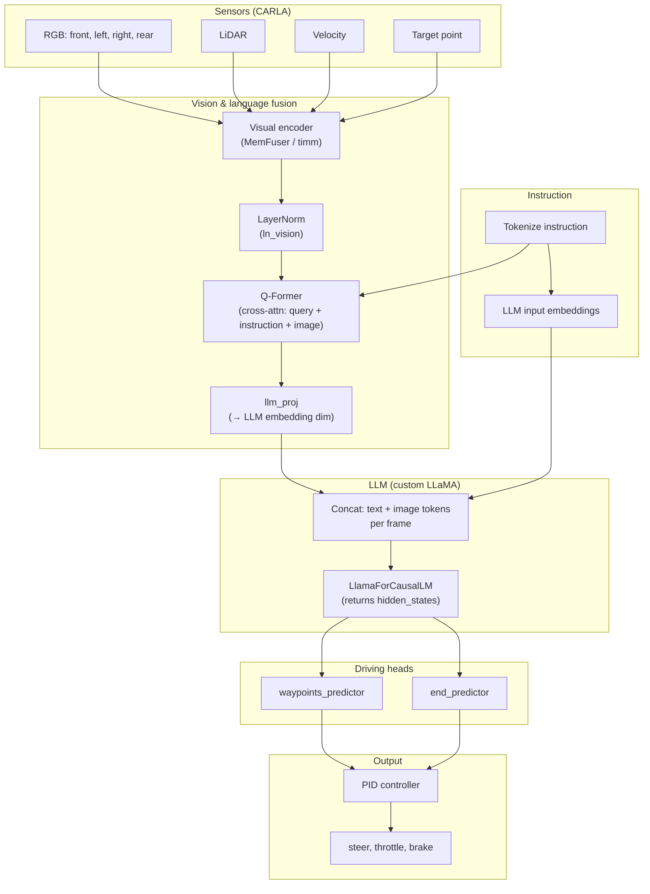
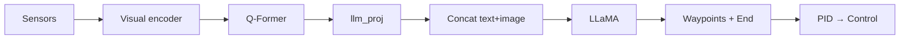

# LMDrive Architecture

High-level architecture of the closed-loop driving model (vision encoder → Q-Former → LLM → driving heads).

---

## Block diagram (Mermaid)

---

## Simplified linear flow

---

## Component summary

| Block | Role |
|-------|------|
| **Visual encoder** | MemFuser: RGB + LiDAR + velocity → spatial features |
| **Q-Former** | Fuse instruction text + image; fixed-length query tokens |
| **llm_proj** | Map query tokens to LLM embedding space |
| **Concat** | Build sequence: [instruction] [frame1 img] [frame2 img] … |
| **LLaMA** | Process sequence; output = **hidden states** (no logits) |
| **Waypoints / End** | MLP heads on hidden states at frame positions → 5 waypoints, end prob |
| **PID** | Waypoints + end prob → steer, throttle, brake |

See [HIDDEN_STATES_AND_FLOW.md](HIDDEN_STATES_AND_FLOW.md) for detailed data flow and tensor shapes.
